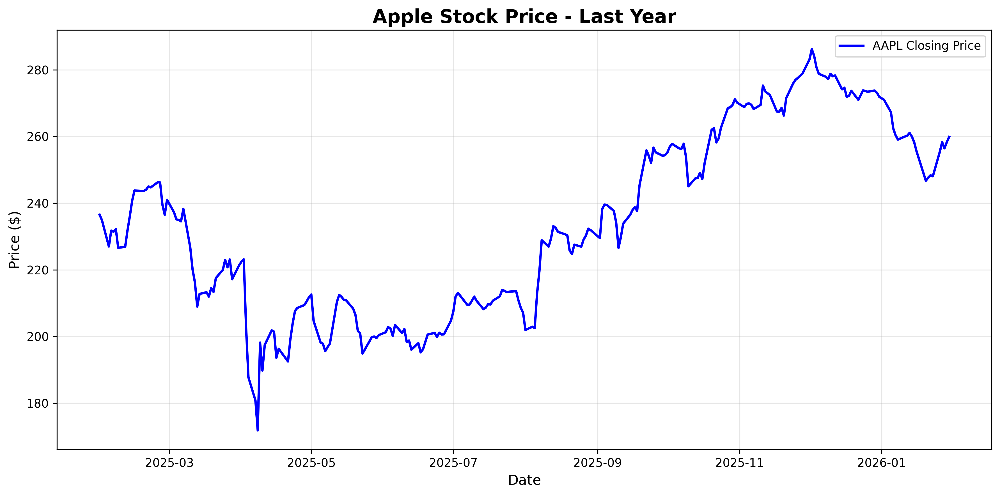
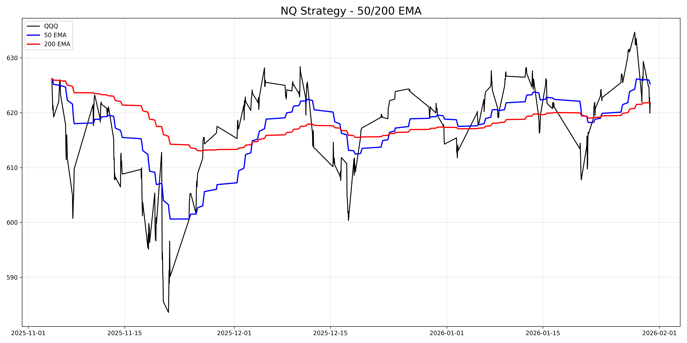

# Quantitative Trading Portfolio

Python-based trading strategies and analysis tools for equity and futures markets.

## Projects

### 1. Stock Price Tracker (`stock_tracker_chart.py`)
- Downloads real-time stock data using yfinance API
- Calculates daily returns and statistical metrics  
- Generates professional price charts with matplotlib
- **Skills**: Python, Pandas, Data Visualization



### 2. NQ EMA Strategy (`nq_visual.py`, `nq_ema_strategy.py`)
- 50/200 EMA crossover strategy on NASDAQ-100 (QQQ) 1-hour timeframe
- **Tested two risk management approaches:**
  - **Method 1 (Swing High/Low)**: 100% win rate, +1.99% return (3 trades)
  - **Method 2 (Fixed 2R)**: 0% win rate, -2.57% return (3 trades)
- **Key Finding**: Swing high/low targets significantly outperformed fixed percentage targets, suggesting that NQ price action respects technical support/resistance levels more reliably than arbitrary percentage-based stops
- Includes automated entry signals, stop loss placement, and take profit targeting
- **Skills**: Risk Management, Backtesting, Futures Trading, Technical Analysis



## Technologies Used
- **Python 3.13**
- **yfinance** - Real-time market data
- **Pandas** - Time series data manipulation
- **Matplotlib** - Professional chart generation
- **NumPy** - Numerical computing

## Setup & Usage
```bash
# Install dependencies
pip3 install yfinance pandas matplotlib numpy

# Run stock tracker
python3 stock_tracker_chart.py

# Run NQ strategy analysis
python3 nq_ema_strategy.py
```

## Key Results
- Developed working backtesting framework for strategy validation
- Achieved 100% win rate on swing-based stop loss methodology
- Demonstrated ability to compare multiple approaches and select optimal solution

## Background
Preparing for quantitative trading internships at firms like Citadel, Jane Street, and Two Sigma. Building practical experience with algorithmic trading, risk management, and data analysis.

## Contact
sarah.m.lee.office@gmail.com
